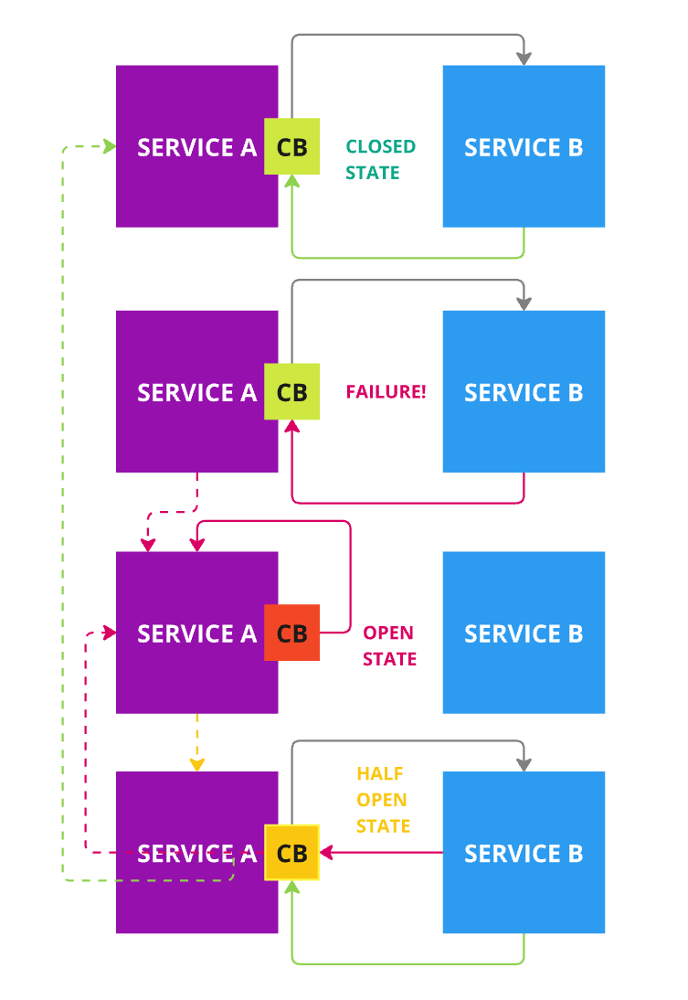

# Demo "Circuit Breaker Pattern"

## What is it?

The Circuit Breaker pattern is designed to improve the resilience of microservices by avoiding cascading failures. It acts like an electrical circuit breaker by monitoring calls to external services and temporarily cutting off requests when a failure threshold is reached. This avoids overloading a failed service and gives it time to recover. Once the service is deemed operational again, the circuit is gradually reopened to verify its proper functioning.





## Requirements

- Docker
- Docker Compose

## How to run

```bash
docker-compose up
```
## Usage

You can use any http client like Postman, Bruno, PhpStorm client (see demo.http) ...

Call the service 1, where the circuit breaker is implemented, using the following command:

```bash
curl -X GET --location "http://127.0.0.1:9080/service1/index" \ -H "Accept: application/json"
```

You can change the state of the service 2, (running or on error) using the following command:

Runnning state (will respond with status 200):
```bash
curl -X POST --location "http://127.0.0.1:9080/service2/change-state" \
    -H "Content-Type: application/json" \
    -d '{
            "new_state": "running"
        }'
```

Error state (will respond with status 500):
```bash
curl -X POST --location "http://127.0.0.1:9080/service2/change-state" \
    -H "Content-Type: application/json" \
    -d '{
            "new_state": "on_error"
        }'
```
